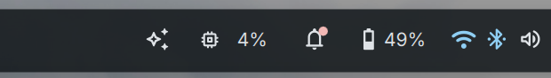
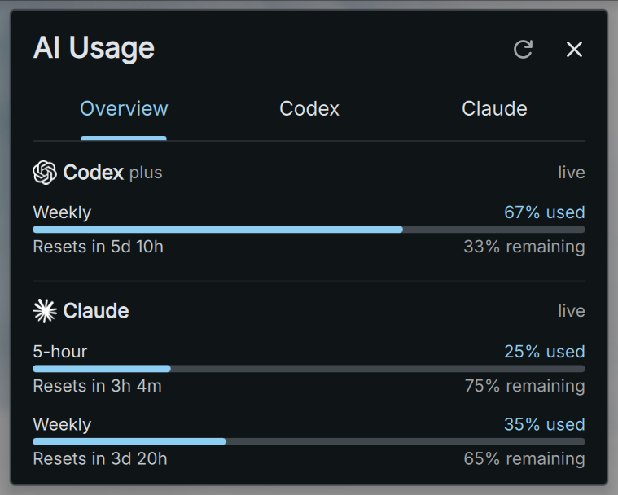
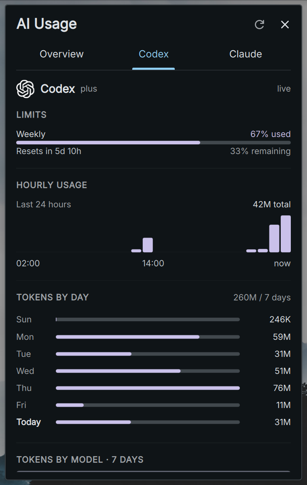
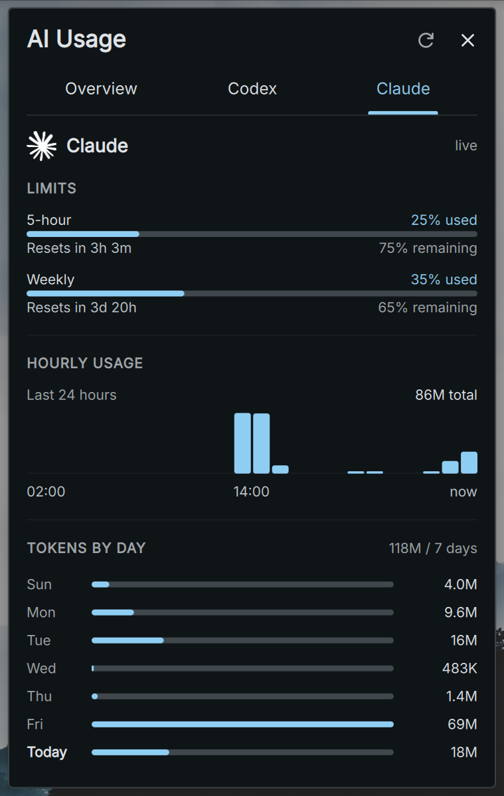

# AI Usage

Claude Code and Codex subscription limits in the DankBar.



| Overview | Codex | Claude |
| --- | --- | --- |
|  |  |  |

## What it shows

| Provider | Limits | Freshness |
| --- | --- | --- |
| Claude | 5-hour, weekly | Live — queried on a 6 minute timer |
| Codex | whatever windows your plan has (weekly on Plus) | Live — queried on a 6 minute timer |

Each provider carries a `live` marker in the popout. When a fetch fails, that
provider keeps its previous numbers and the marker becomes their age (`7m ago`)
rather than the row disappearing. After an hour with no successful fetch the
provider drops out entirely.

The bar shows a single `insights` icon, tinted by the highest utilization across
everything enabled: normal text color under 70%, amber at 70%, red at 90%. It
stays quiet until something needs attention. Turn the tint off in settings for a
plain icon that never changes color.

Left-click for a three-tab detail popout:

- **Overview** — live used/remaining meters for both enabled providers, with no
  session-log work.
- **Codex** / **Claude** — that provider's live limits, a hoverable 24-hour
  chart, seven local-calendar-day bars, and the same seven-day total grouped by
  recorded model.

Provider analytics are lazy: opening Overview never scans session logs. The
first visit to Codex or Claude builds only that provider's cache, after which
the active tab refreshes on the same timer. Refresh from the header button, or
right-click the pill.

Analytics count local session tokens, while the meters are subscription limits
published by each provider. Limit utilization is weighted by model and plan, so
token totals should not be read as a forecast of when a limit will be hit.

## How the data is obtained

`fetch-usage.sh` writes a normalized blob to
`$XDG_CACHE_HOME/dms-ai-usage.json`; the QML watches that file, so several
monitors share a single fetch.

**Claude** — reads the OAuth access token Claude Code already stores in
`~/.claude/.credentials.json` and calls `api.anthropic.com/api/oauth/usage`
with it, the same endpoint the client uses for `/usage`. The token goes
nowhere else. If it 401s (signed out), the provider is eventually omitted.

That endpoint allows only about two requests per five minutes, and Claude Code
itself draws on the same budget, so a poll returning 429 is routine — hence the
6 minute timer and the carry-forward above.

**Codex limits** — starts the local Codex App Server and calls its supported
`account/rateLimits/read` JSON-RPC method. The response includes the live usage
percentage, window duration, reset time, and plan for every metered limit
bucket. This live-limit path never reads Codex session rollout logs.

Both providers are optional — the widget renders whichever ones report.

### Provider analytics

`fetch-history.sh codex|claude` builds one provider cache on demand:
`$XDG_CACHE_HOME/dms-ai-usage-PROVIDER-history.json`. One pass produces all
three views—24 hourly buckets, seven local calendar days, and seven-day model
totals—so the UI never launches separate scans for each chart. Only files
modified inside the seven-day window are opened.

Totals include input, output, cache writes, and cache reads. This matches the
large "tokens processed" values shown by local usage tools and keeps hourly,
daily, and model totals internally consistent.

**Claude** — `~/.claude/projects/**/*.jsonl`, assistant lines carrying
`message.usage`. These are duplicated across sidechains, so rows are
deduplicated on `(message.id, requestId)` — typically cutting the row count in
half.

**Codex** — `~/.codex/sessions/**/*.jsonl`, `token_count` events carrying
`info.last_token_usage`. Each per-request delta is attributed to the latest
recorded `turn_context.model`; summing the deltas reproduces the session's own
`total_token_usage`, so no deduplication is needed.

Hourly buckets are aligned to local hour boundaries. Daily bars use real local
midnights, including daylight-saving transitions.

## Settings

Settings → Plugins → AI Usage:

- **Show Claude Code** / **Show Codex**
- **Tint the bar icon by usage**

The first two control which providers appear in Overview and contribute to the
bar warning color. Provider tabs remain available for direct inspection.

The third turns the bar icon's warning color off entirely: the glyph holds the
ordinary bar text color at any utilization, and the popout still carries the
percentages. Thresholds live in `AiUsageWidget.qml`: `warnPct` (70, amber) and
`critPct` (90, red). The bar glyph is the `name:` on the two `DankIcon`s in the
pill components — any Material Symbols name works.

Note that `horizontalBarPill` / `verticalBarPill` should contain **content
only**. `PluginComponent` wraps whatever you supply in a `BasePill`, which
already draws the pill background and outline, applies the bar's configured
`widgetPadding`, and owns hover/ripple/click — and sizes itself from your
content's `implicitWidth`. Wrapping the content in your own `StyledRect` gives
you a second background inside the real one, with padding that ignores the
bar's settings.

## Files

| File | Role |
| --- | --- |
| `plugin.json` | manifest — id, surfaces, permissions |
| `fetch-usage.sh` | both providers → one JSON blob + cache |
| `fetch-codex-limits.sh` | live Codex App Server JSON-RPC client |
| `fetch-history.sh` | one provider's session logs → hourly, daily, and model analytics |
| `AiUsageData.qml` | runs the scripts, watches the caches, parses them |
| `UsageGraph.qml` | the hourly bar charts |
| `UsageProviderPage.qml` | provider limits, daily bars, and weekly model breakdown |
| `AiUsageWidget.qml` | bar pills (horizontal + vertical) and popout |
| `AiUsageSettings.qml` | settings page |
| `assets/*.svg` | provider logos, normalized to a white fill |

The logos ship with a `#ffffff` fill so `DankSVGIcon`'s `colorOverride` lands
exactly on the theme color — colorization multiplies by source luminance, so a
black-filled source would stay black.

## Development

```sh
sh fetch-usage.sh | jq            # check the data layer alone
sh fetch-history.sh codex | jq '{hourly, daily, models}'
sh fetch-history.sh claude | jq '{hourly, daily, models}'
dms ipc call plugin-scan scan     # pick up manifest changes
dms ipc call plugins reload aiUsage
qs -p /usr/share/quickshell/dms log | tail   # QML errors land here
```

Requires `bash`, `jq`, and `curl`. Codex limits additionally require a recent
`codex` CLI signed in with ChatGPT.

### Adding new QML files

Qt resolves same-directory types from a directory listing it caches when the
engine starts. A `.qml` file added *after* that stays `"X is not a type"` through
any number of `plugins reload` calls — and because the widget then fails to
compile, the whole plugin drops out of the bar rather than just losing the new
part. Neither `plugin-scan rescan` nor `plugins reload` clears it; only a shell
restart does.

`AiUsageData.qml`, `UsageProviderPage.qml` and `UsageGraph.qml` are loaded by
URL so the main widget can still compile if an optional page fails. A shell
restart is still required once when these files are first added.

### Why the loader URLs carry a `?r=` query

`plugins reload` on its own does not pick up an edit to a URL-loaded file. Qt
caches compiled components by URL, and `PluginService.loadPlugin` busts that
cache only on the plugin's own surface URLs — it appends a `?t=` to
`AiUsageWidget.qml` and to nothing else. A nested
`Qt.resolvedUrl("UsageProviderPage.qml")` therefore keeps serving the copy
compiled before the edit, and does it silently: the reload reports success while
the old code keeps running.

`AiUsageWidget.qml` mints a `reloadToken` once per load and appends it to every
nested loader URL, passing it down to `UsageProviderPage.qml` for the graph. So
edit any of these files and a plain `plugins reload` is enough. Anything added
later that loads a sibling by URL needs the token too.
