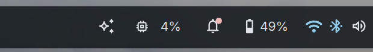
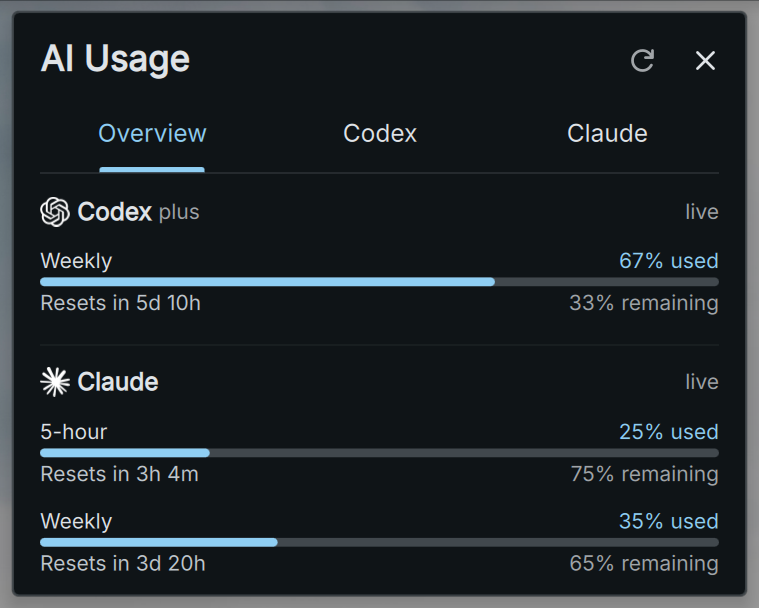
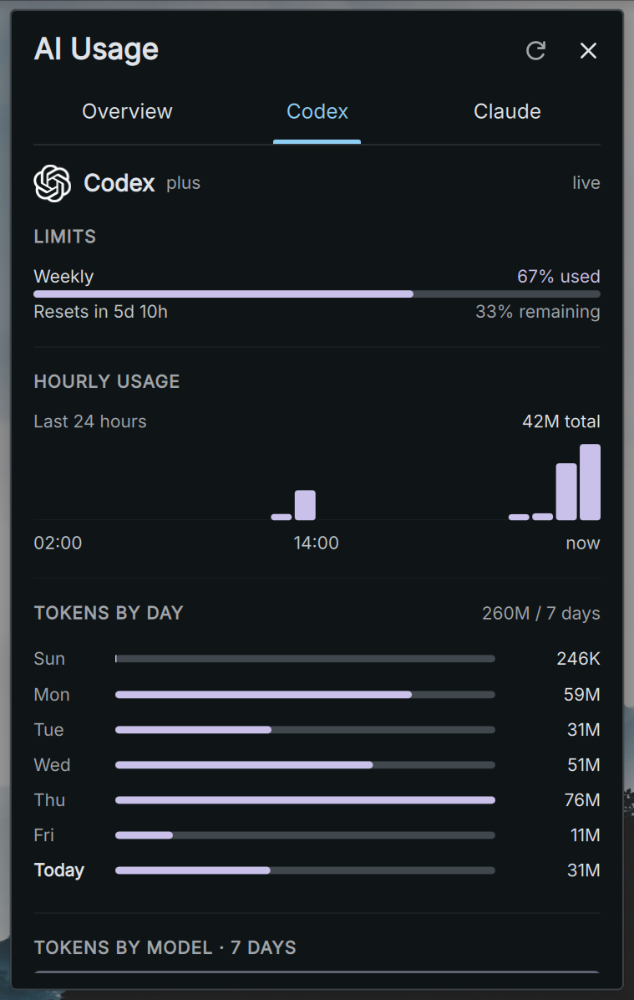
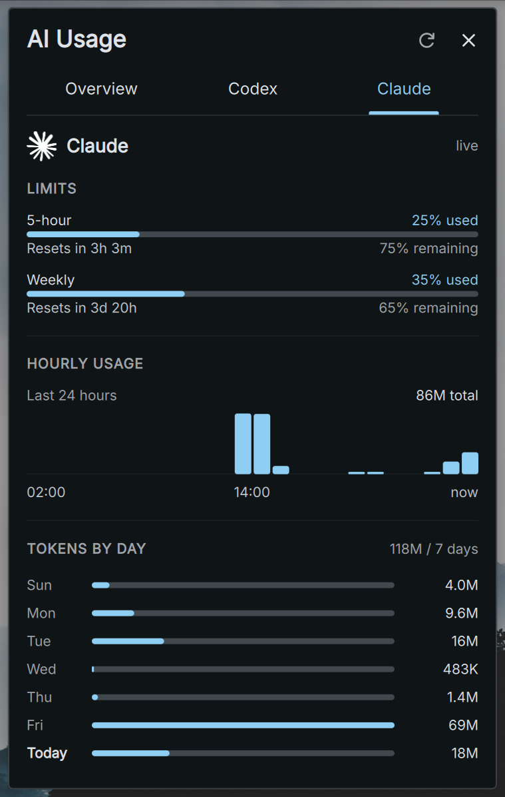

# AI Usage

Claude Code and Codex subscription limits in the DankBar.



| Overview | Codex | Claude |
| --- | --- | --- |
|  |  |  |

## What it shows

| Provider | Limits | Freshness |
| --- | --- | --- |
| Claude | 5-hour, weekly, plus usage credits when the account has them | Live — queried on a 6 minute timer |
| Codex | whatever windows your plan has (weekly on Plus) | Live — queried on a 6 minute timer |

Each provider carries a `live` marker in the popout. When a fetch fails, that
provider keeps its previous numbers and the marker becomes their age (`7m ago`)
rather than the row disappearing. After an hour with no successful fetch the
provider drops out entirely.

The bar shows an `insights` icon, tinted by the highest utilization across
everything enabled: normal text color under 70%, amber at 70%, red at 90%. It
stays quiet until something needs attention. Turn the tint off in settings for a
plain icon that never changes color.

That percentage can sit in the bar beside the icon, or replace it — see **Bar
pill contents** below. It is the same maximum the tint reads, so the digits and
the color can never disagree. A vertical bar drops the percent sign, because the
pill is only as wide as the bar is thick.

Hovering the pill names which limit that number came from —
`Codex Weekly 12% · Claude Weekly 20%`, plus `Credits 43%` when the account has
them. `DankTooltip` is one line and clamps at 300px, so the window labels drop
out when the line would not fit whole, rather than letting an ellipsis eat
whichever provider comes last. The tooltip yields while the popout is open,
including on bars that open popouts on hover.

A limit passing 70% raises a desktop notification, and 90% raises a critical
one, at most once per window per threshold. Details in **Threshold
notifications** below.

Left-click for a three-tab detail popout:

- **Overview** — live used/remaining meters for both enabled providers, with no
  session-log work.
- **Codex** / **Claude** — that provider's live limits, a hoverable 24-hour
  chart, seven local-calendar-day bars, and the same seven-day total grouped by
  recorded model.

Provider analytics are lazy: opening Overview never scans session logs. The
first visit to Codex or Claude builds only that provider's cache, after which
the active tab refreshes on the same timer. Refresh from the header button, or
right-click the pill.

Analytics count local session tokens, while the meters are subscription limits
published by each provider. Limit utilization is weighted by model and plan, so
token totals should not be read as a forecast of when a limit will be hit.

## How the data is obtained

`fetch-usage.sh` writes a normalized blob to
`$XDG_CACHE_HOME/dms-ai-usage.json`; the QML watches that file, so several
monitors share a single fetch.

**Claude** — reads the OAuth access token Claude Code already stores in
`~/.claude/.credentials.json` and calls `api.anthropic.com/api/oauth/usage`
with it, the same endpoint the client uses for `/usage`. The token goes
nowhere else.

That response also carries the account's overage credits, which become a
`Credits` meter under the two windows. Money is not a window that reopens, so it
rides beside the limits as `claude.spend` rather than among them, and stays null
for an account with no credits enabled. Two blocks describe it — the newer
`spend` and the older `extra_usage` — so the fetch prefers `spend` and falls
back. Amounts stay in minor units with their own exponent (858 with exponent 2
is $8.58) all the way to the QML, which is what keeps a zero-decimal currency
from picking up two decimal places on the way. An account with credits switched
on but no cap gets the amount alone: there is no fraction to draw.

That endpoint allows only about two requests per five minutes, and Claude Code
itself draws on the same budget, so a poll returning 429 is routine — hence the
6 minute timer and the carry-forward above.

The token expires after about eight hours, and only Claude Code itself can renew
it — from a refresh token this plugin never touches. So the ordinary reason
Claude's limits go missing is a lapsed token, not an outage, and the snapshot
carries a `claude_auth` field (`ok` / `expired` / `signed_out`) to say so:
`expired` covers both a passed `expiresAt` and a token the endpoint refuses,
since starting a session is the fix for either. The widget names the state
rather than reporting a bare "unavailable", and holds its place in the bar while
a token is expired so the explanation stays reachable.

**Codex limits** — starts the local Codex App Server and calls its supported
`account/rateLimits/read` JSON-RPC method. The response includes the live usage
percentage, window duration, reset time, and plan for every metered limit
bucket. This live-limit path never reads Codex session rollout logs.

Both providers are optional — the widget renders whichever ones report.

### Threshold notifications

`fetch-usage.sh` raises them, not the QML, for two reasons: it is the one place
that knows a fetch actually happened rather than a cache being served, and it
compares the new numbers against the cache still on disk. The write and that
comparison share a lock, so several bars on several screens produce one alert
between them — whoever writes first alerts, and the others read back the
snapshot just written and find nothing crossed. Thresholds are passed in from
the widget (`--warn`, `--crit`) rather than declared a second time in shell.

Only an upward crossing counts, which makes the "once per window" behaviour fall
out of the data instead of needing to be remembered anywhere:

- A bucket with no previous reading seeds silently. First run on a machine, or a
  provider that has only started answering, will not announce a number that may
  have been sitting there for days.
- A window that rolls over drops to zero. That is not a crossing, and it re-arms
  the alert for the next climb.
- A poll that jumps clean past both thresholds reports the higher one only.
- A carried-forward provider has identical numbers by definition, so a routine
  429 cannot re-announce anything.

Credits are the exception to the reset rule: they have a cap and no window, so
they cross once and stay crossed until the account tops up. `--no-notify` turns
the whole thing off, and the toggle in settings does it for you.

### Provider analytics

`fetch-history.sh codex|claude` builds one provider cache on demand:
`$XDG_CACHE_HOME/dms-ai-usage-PROVIDER-history.json`. One pass produces all
three views—24 hourly buckets, seven local calendar days, and seven-day model
totals—so the UI never launches separate scans for each chart. Only files
modified inside the seven-day window are opened.

Totals include input, output, cache writes, and cache reads. This matches the
large "tokens processed" values shown by local usage tools and keeps hourly,
daily, and model totals internally consistent.

**Claude** — `~/.claude/projects/**/*.jsonl`, assistant lines carrying
`message.usage`. These are duplicated across sidechains, so rows are
deduplicated on `(message.id, requestId)` — typically cutting the row count in
half.

**Codex** — `~/.codex/sessions/**/*.jsonl`, `token_count` events carrying
`info.last_token_usage`. Each per-request delta is attributed to the latest
recorded `turn_context.model`; summing the deltas reproduces the session's own
`total_token_usage`, so no deduplication is needed.

Hourly buckets are aligned to local hour boundaries. Daily bars use real local
midnights, including daylight-saving transitions.

## Settings

Settings → Plugins → AI Usage:

- **Show Claude Code** / **Show Codex**
- **Bar pill contents** — icon only, icon and percentage, or percentage only
- **Tint the bar icon by usage**
- **Notify at usage thresholds**
- **Count credit spend in the bar tint**

The first two control which providers appear in Overview and contribute to the
bar warning color. Provider tabs remain available for direct inspection.

**Bar pill contents** decides what the pill draws; the hover summary is there in
every mode. Percentage-only suits a bar already carrying plenty of glyphs. Note
that icon-only with the tint switched off leaves the pill saying nothing at all
until you hover or click it — which is a reasonable thing to want, and worth
choosing on purpose rather than ending up with.

The tint toggle turns the bar icon's warning color off entirely: the glyph holds the
ordinary bar text color at any utilization, and the popout still carries the
percentages. Thresholds live in `AiUsageWidget.qml`: `warnPct` (70, amber) and
`critPct` (90, red). They set the notification levels too — the widget passes
them to `fetch-usage.sh` — so a bar that has gone amber and a notification
saying so are always the same event. The bar glyph is the `name:` on the
`DankIcon` in `BarPill` — any Material Symbols name works.

**Notify at usage thresholds** is on by default. A normal notification at
`warnPct`, a critical one at `critPct`, carrying the provider's own icon and how
long the window has left.

**Count credit spend in the bar tint** is off by default, and the default is the
point: an amber bar has so
far always meant a window that reopens on a clock the popout names. Credits do
not reopen — they are spent — so folding them into the same color silently
changes what it means. Turn it on to have the credit meter warn the bar too; a
reached limit counts as 100 regardless of the percentage reported. This governs
the bar color only — notifications are a separate channel and always cover
credits.

Note that `horizontalBarPill` / `verticalBarPill` should contain **content
only**. `PluginComponent` wraps whatever you supply in a `BasePill`, which
already draws the pill background and outline, applies the bar's configured
`widgetPadding`, and owns hover/ripple/click — and sizes itself from your
content's `implicitWidth`. Wrapping the content in your own `StyledRect` gives
you a second background inside the real one, with padding that ignores the
bar's settings.

## Files

| File | Role |
| --- | --- |
| `plugin.json` | manifest — id, surfaces, permissions |
| `fetch-usage.sh` | both providers → one JSON blob + cache |
| `fetch-codex-limits.sh` | live Codex App Server JSON-RPC client |
| `fetch-history.sh` | one provider's session logs → hourly, daily, and model analytics |
| `AiUsageData.qml` | runs the scripts, watches the caches, parses them |
| `UsageGraph.qml` | the hourly bar charts |
| `UsageProviderPage.qml` | provider limits, daily bars, and weekly model breakdown |
| `AiUsageWidget.qml` | bar pills (horizontal + vertical) and popout |
| `AiUsageSettings.qml` | settings page |
| `assets/*.svg` | provider logos, normalized to a white fill |

The logos ship with a `#ffffff` fill so `DankSVGIcon`'s `colorOverride` lands
exactly on the theme color — colorization multiplies by source luminance, so a
black-filled source would stay black.

## Development

```sh
sh fetch-usage.sh | jq            # check the data layer alone
sh fetch-history.sh codex | jq '{hourly, daily, models}'
sh fetch-history.sh claude | jq '{hourly, daily, models}'
dms ipc call plugin-scan scan     # pick up manifest changes
dms ipc call plugins reload aiUsage
qs -p /usr/share/quickshell/dms log | tail   # QML errors land here
```

Requires `bash`, `jq`, and `curl`. Codex limits additionally require a recent
`codex` CLI signed in with ChatGPT. Threshold notifications need `notify-send`
from libnotify; without it they are skipped and nothing else changes.

```sh
# Watch a crossing without waiting for one, against a scratch cache:
CACHE_FILE=/tmp/usage.json MIN_AGE=0 sh fetch-usage.sh --notify --warn 5 --crit 15
```

### Adding new QML files

Qt resolves same-directory types from a directory listing it caches when the
engine starts. A `.qml` file added *after* that stays `"X is not a type"` through
any number of `plugins reload` calls — and because the widget then fails to
compile, the whole plugin drops out of the bar rather than just losing the new
part. Neither `plugin-scan rescan` nor `plugins reload` clears it; only a shell
restart does.

`AiUsageData.qml`, `UsageProviderPage.qml` and `UsageGraph.qml` are loaded by
URL so the main widget can still compile if an optional page fails. A shell
restart is still required once when these files are first added.

### Why the loader URLs carry a `?r=` query

`plugins reload` on its own does not pick up an edit to a URL-loaded file. Qt
caches compiled components by URL, and `PluginService.loadPlugin` busts that
cache only on the plugin's own surface URLs — it appends a `?t=` to
`AiUsageWidget.qml` and to nothing else. A nested
`Qt.resolvedUrl("UsageProviderPage.qml")` therefore keeps serving the copy
compiled before the edit, and does it silently: the reload reports success while
the old code keeps running.

`AiUsageWidget.qml` mints a `reloadToken` once per load and appends it to every
nested loader URL, passing it down to `UsageProviderPage.qml` for the graph. So
edit any of these files and a plain `plugins reload` is enough. Anything added
later that loads a sibling by URL needs the token too.
